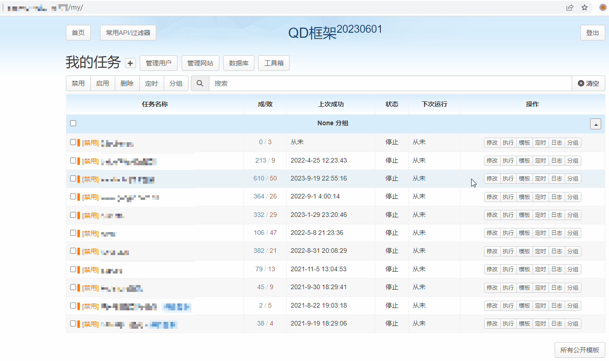

# Get-Cookies 插件

一键获取 Cookies 的 Chrome 扩展, 用于配合 QD 框架使用

QD 框架: <https://github.com/qd-today/qd>

Docker 容器: <https://hub.docker.com/r/qdtoday/qd>

## 使用方式

推荐形式：前往Chrome商店安装。（非公开扩展只可链接直达）
[商店页面](https://chromewebstore.google.com/detail/cookies%E8%8E%B7%E5%8F%96%E5%8A%A9%E6%89%8B/mmcdaoockinhaeiljdmjmnjfndpfpklo) 

或者

1. 项目代码完整打包下载，使用 Chrome浏览器 -> `扩展` -> `加载已解压的扩展程序` 来使用;

2. 前往 [Releases](https://github.com/qd-today/get-cookies/releases/latest) 下载安装打包好的 `.crx` 文件.

> 注意: 使用前请进入 Chrome 扩展详情, 打开 `扩展程序选项`, 根据提示填入 QD 框架对应 `ip或域名` 信息.
> [这里有参考图例](https://github.com/qd-today/get-cookies/issues/11) 

- ### Screenshots

## Tips

插件目前支持**隐私模式**下访问的网站的 Cookies 

需要打开扩展设置，打开“在无痕模式下启用”功能。

> 扩展在隐私模式下与普通模式数据隔离，如需获得目标网站的Cookies，需要同时在隐私模式下登陆目标网站与框架网站
>

## 更新内容
- ### v2.3.1

    支持隐私模式

- ### v2.3.0

    移除旧传递方法，修改内核以适配FF扩展

- ### v2.2.3

    添加空cookies的处理

    > 临时保留2.1.0旧方法。下版本移除。注意及时更新QD框架

- ### v2.1.0

    修改与QD框架的通信方法，防止因其他扩展滥用postMessage而造成的插件失效

    > 临时保留旧方法，使其暂时兼容旧qd框架

- ### v2.0.0

    针对 Chrome 强制推进的 **Manifest V3** 标准进行了代码的整体迁移和更新, 未有功能上的改进。

    目前在新版浏览器上应该能正常运作。

    > 只部分测试了功能上的正常，未广泛进行兼容性测试，有bug欢迎提交issue

- ### v1.0.3

    小改进: 同时增加对旧版平台 BUG 的兼容 (编辑测试界面无法获取cookie, 新版 QD 框架已修正)

- ### v1.0.0

    修改匹配及注入方式，添加设定选项方便自行添加需要启用的网站

## 鸣谢

- [ckx000](https://github.com/ckx000)
- [acgotaku(原作者)](https://github.com/acgotaku/GetCookies)
